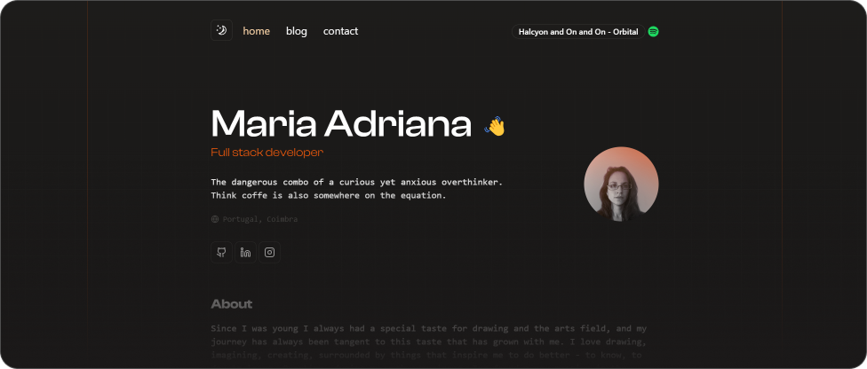

# maria-adriana.com

- Stack: TanStack Start + Vite + React 19 + TanStack Router
- Styling: Tailwind CSS 4 + Shadcn/ui components
- Content: Sanity CMS for blog/projects + MD/MDX-based static content
- Deployment: Hosted on Raspberry PI w/ Coolify

## Architecture

- TanStack Start drives both the client and SSR builds through Vite.
- The document shell is defined in the root route (`src/routes/__root.tsx`).
- Routes are defined with TanStack Router file routes (`src/routes/**`).
- Server endpoints live in file routes with `server.handlers` (for example `src/routes/api/**` and `src/routes/sitemap.xml.ts`).

## Project Structure

- `src/routes/**` - TanStack Router page routes and server routes (for example `index.tsx`, `api/send.ts`).
- `src/components/**` - UI components, Shadcn/ui wrappers, and page sections.
- `src/styles/**` - Tailwind/global CSS and page-specific styles.
- `src/data/**` - Content data access and Markdown/MDX static pages.
- `src/server-fns/**` - TanStack Start server functions used by route loaders.
- `server/**` - Server-only helpers (mail, Spotify, sitemap, MDX rendering).
- `cms/**` - Sanity Studio configuration and schema for blog and projects.
- `public/**` - Static assets (images, fonts, favicon).
- `index.html` - Vite placeholder file; the runtime HTML shell comes from the root route.

## Scripts

- `dev` - TanStack Start dev server with SSR and HMR.
- `build` - Production client + server build to `dist/client` and `dist/server`.
- `preview` - Preview the production build locally through Vite.

## Run Locally

1. Copy `.env.sample` to `.env` and fill values.
2. Run `pnpm dev` and open the local URL Vite prints.
3. For a production preview, run `pnpm build` and then `pnpm preview`.

## License

MIT [Maria Adriana](https://github.com/mariadriana-deemaze/portfolio-2024/blob/main/LICENSE)
