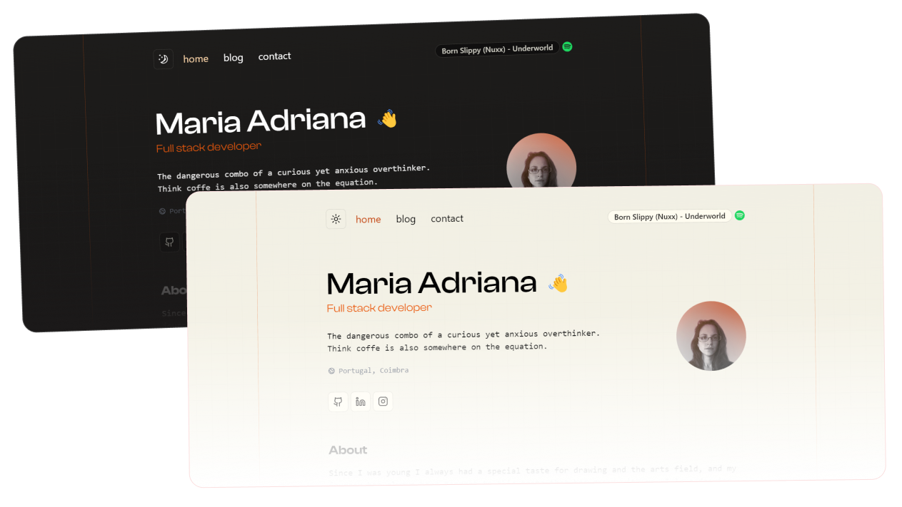

# 🚀 maria-adriana.com

- Stack: Express server with Vite + React 19 + TanStack Router
- Styling: Tailwind CSS 4 + Shadcn/ui components
- Content: Sanity CMS for blog posts + MD/MDX-based static content
- Deployment: Hosted on Raspberry PI w/ Coolify

## Architecture

- Vite drives both client build and SSR dev HMR.
- Express server handles SSR HTML, static assets, sitemap, and JSON APIs.
- Routes are defined with TanStack Router (`src/routes/**`), rendered on the server with `src/entry-server.tsx`.
- API endpoints live under `server/routes/api/**` (e.g., contact form, Spotify).

## Project Structure

- `src/routes/**` - Route files for TanStack Router (e.g., `index.tsx`, `blog/$slug.tsx`).
- `src/components/**` - UI components, Shadcn/ui wrappers, and page sections.
- `src/styles/**` - Tailwind/global CSS and page-specific styles.
- `src/data/**` - Markdown/MDX content for projects and static pages.
- `server.ts` - Dev/prod Express server with SSR.
- `server/routes/**` - Route matching helpers and API handlers.
- `cms/**` - Sanity Studio configuration and schema for blog posts.
- `public/**` - Static assets (images, fonts, favicon).
- `index.html` - Vite HTML template used in SSR assembly.

## Scripts

- `dev` - Vite dev server (client-only; default Vite port).
- `dev:ssr` - Express + Vite middleware with SSR and HMR at `http://localhost:3000`.
- `build` - Client production build to `dist/`.
- `build:ssr` - SSR build of `src/entry-server.tsx` to `dist-ssr/`.
- `serve` - Start the Express server (expects prior `build` + `build:ssr`).

## Run Locally

1) Copy `.env.sample` to `.env` and fill values.

2) Run `npm run dev:ssr` then open `http://localhost:3000`.

3) Production preview:
- `npm run build && npm run build:ssr`
- `npm run serve` then open `http://localhost:3000`

## License

MIT © [Maria Adriana](https://github.com/mariadriana-deemaze/portfolio-2024/blob/main/LICENSE)
